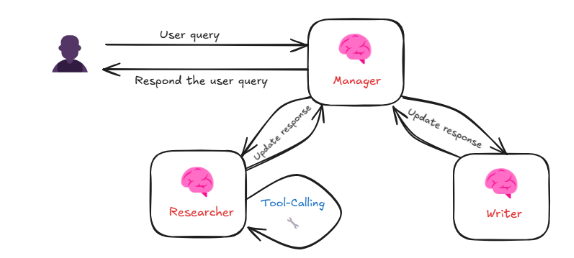

## 🧠 Manager Agent Architecture

This repository implements an intelligent, manager-centric agent architecture designed to coordinate specialized agents through a controlled delegation model. The **Manager Agent** acts as the central brain of the system, orchestrating tasks among agents such as the **Researcher** and **Writer**, each with well-defined roles.
By simulating a human-like delegation workflow, this architecture enables the system to handle complex queries with precision, adaptability, and clarity. The Manager oversees task distribution, supervises agent outputs, and consolidates final answers—ensuring high-quality results through structured, modular collaboration.

---

## 📌 Overview

The architecture consists of three main components organized in a centralized, manager-driven flow:

- **🧠 Manager Agent**  
  Acts as the orchestrator of the system. It receives the user’s input, analyzes the intent, delegates tasks to the appropriate specialized agents, monitors the output, and consolidates the final response.

- **🔍 Researcher Agent**  
  A specialized agent responsible for searching, gathering, and verifying information using external tools or APIs. It is triggered when the query requires factual data, research, or information retrieval.

- **✍️ Writer Agent**  
  Focused on rewriting, summarizing, or restructuring the collected content. It improves the clarity, coherence, and final presentation of the response before it is delivered to the user.

This architecture enables a modular and controlled multi-agent system, simulating a human-like delegation workflow in which a central manager assigns tasks to subject-matter experts.

---

## 📷 Flow Diagram

---

## 🔁 Execution Flow

1. **Receiving the User Question**  
   The process begins when the user submits a query.  
   The **Manager** analyzes the query and defines a strategy to handle it, deciding whether to involve the **Researcher**, the **Writer**, or both.

2. **Triggering the Researcher**  
   If the query requires research, data collection, or fact-checking, the **Manager** delegates the task to the **Researcher**.  
   The **Researcher** may use tool-calling capabilities (APIs, search engines, external tools) to gather the necessary data.

3. **Returning the Researcher's Output**  
   The **Researcher** sends the processed data back to the **Manager**, which could be raw information or partial content.

4. **Triggering the Writer**  
   Based on the initial analysis or the Researcher’s output, the **Manager** may trigger the **Writer**.  
   The **Writer** is responsible for refining, restructuring, or rewriting the content, ensuring clarity and coherence.

5. **Monitoring and Updating**  
   The **Manager** supervises the generated content and ensures it aligns with the original user intent.  
   If necessary, the **Manager** may re-engage the **Researcher** or **Writer** for additional adjustments.

6. **Final Response Consolidation**  
   Once all steps are complete, the **Manager** consolidates the final output and delivers it to the user.

   ## 💬 Example Interaction

**User Input:**  
*"Who is the CEO of OpenAI and where was he born?"*

**Execution Breakdown:**  
- The **Manager** receives the query and identifies that it requires factual information and natural language formatting.
- The **Researcher** is triggered and returns:  
*"The CEO of OpenAI is Sam Altman. He was born in Chicago, Illinois, USA."*
- The **Writer** is then triggered to refine the response:  
*"Sam Altman, the CEO of OpenAI, was born in Chicago, Illinois."*
- The **Manager** validates the response, confirms alignment with the user’s question, and delivers it.

